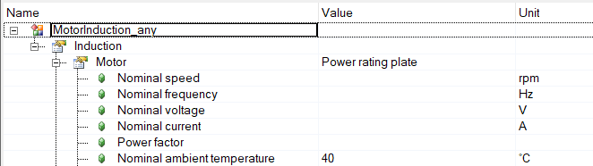
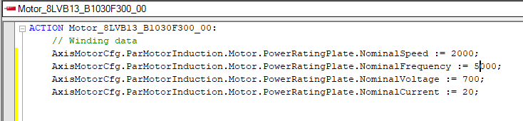

#### Conversion table for Induction motors
The conversion table was created to the best of our knowledge but there is no guaranty that it is 100% correct. Please double check critical values in the Automation Studio help before using them.
If you find any errors or have any suggestions please create an [issue](https://github.com/br-automation-com/mappMotion-Samples/issues) on github. 

The table uses the following notation:

<table style="width: 100%">
    <colgroup>
       <col span="1" style="width: 60%;">
    </colgroup>
    <tr>
        <td>
            
        </td>
        <td>
            The configuration column shows the Automation Studio configuration. Each branch in the tree is presented as a list. For example the value shown in the left picture is written as:
              
            Induction Motor Number of pole pairs            
        </td>
    </tr>
    <tr>
        <td>
            
        </td>
        <td>
            The structure column shows the same value in code. Each element of the structure is presented as a list. For example the value shown in the left picture is written as:
              
            Motor PowerRatingPlate NumberOfPolePairs
        </td>Switching PTC thermistor
    </tr>
</table>

| Configuration name | Structure name | Constant | Par ID | Note |
|---|---|---|---|---|
| Induction Motor Nominal speed | Motor PowerRatingPlate NominalSpeed | MOTOR_SPEED_RATED | 50 | Power rating plate |
| Induction Motor Nominal frequency | Motor PowerRatingPlate NominalFrequency | MOTOR_FREQ_RATED | | Power rating plate |
| Induction Motor Nominal voltage | Motor PowerRatingPlate NominalVoltage | MOTOR_VOLTAGE_RATED | 48 | Power rating plate |
| Induction Motor Nominal current | Motor PowerRatingPlate NominalCurrent | MOTOR_CURR_RATED | 57 | Power rating plate |
| Induction Motor Power Factor | Motor PowerRatingPlate PowerFactor | MOTOR_POWER_FACTOR | | Power rating plate |
| Induction Motor Nominal ambient temperature | Motor PowerRatingPlate NominalAmbientTemperature | MOTOR_AMB_TEMP_RATED | 865 ||
| Induction Motor Optional Parameters Number of pole pairs | Motor PowerRatingPlate OptionalParameter NumberOfPolePairs | MOTOR_POLEPAIRS | 47 | Power rating plate |
| Induction Motor Optional Parameters Maximum speed | Motor PowerRatingPlate OptionalParameter MaximumSpeed | MOTOR_SPEED_MAX | 51 | Power rating plate |
| Induction Motor Optional Parameters Stall current | Motor PowerRatingPlate OptionalParameter StallCurrent | MOTOR_CURR_STALL | 56 | Power rating plate |
| Induction Motor Optional Parameters Peak current | Motor PowerRatingPlate OptionalParameter PeakCurrent | MOTOR_CURR_MAX | 58 | Power rating plate |
| Induction Motor Optional Parameters Magnetizing current | Motor PowerRatingPlate OptionalParameter MagnetizingCurrent | MOTOR_MAGNETIZING_CURR | 59 | Power rating plate |
| Induction Motor Optional Parameters Nominal Power | Motor PowerRatingPlate OptionalParameter NominalPower | MOTOR_POWER_RATED || Power rating plate |
| Induction Motor Optional Parameters Nominal torque | Motor PowerRatingPlate OptionalParameter NominalTorque | MOTOR_TORQ_RATED | 53 | Power rating plate |
| Induction Motor Optional Parameters Stall torque | Motor PowerRatingPlate OptionalParameter StallTorque | MOTOR_TORQ_STALL | 52 | Power rating plate |
| Induction Motor Optional Parameters Peak torque | Motor PowerRatingPlate OptionalParameter PeakTorque | MOTOR_TORQ_MAX | 54 | Power rating plate |
| Induction Motor Optional Parameters Moment of inertia | Motor PowerRatingPlate OptionalParameter MomentOfInertia | MOTOR_INERTIA | 62 |  Power rating plate AS uses kgcm^2^ PAR ID uses kgm^2^ |
| Induction Motor Nominal speed | Motor StarEquivalentCircuit NominalSpeed | MOTOR_SPEED_RATED | 50 | Star equivalent circuit |
| Induction Motor Maximum speed | Motor StarEquivalentCircuit MaximumSpeed | MOTOR_SPEED_MAX | 51 | Star equivalent circuit |
| Induction Motor Nominal voltage | Motor StarEquivalentCircuit NominalVoltage | MOTOR_VOLTAGE_RATED | 48 | Star equivalent circuit |
| Induction Motor Nominal current | Motor StarEquivalentCircuit NominalCurrent | MOTOR_CURR_RATED | 57 | Star equivalent circuit |
| Induction Motor Stall current | Motor StarEquivalentCircuit StallCurrent | MOTOR_CURR_STALL | 56 | Star equivalent circuit |
| Induction Motor Peak current | Motor StarEquivalentCircuit PeakCurrent | MOTOR_CURR_MAX | 58 | Star equivalent circuit |
| Induction Motor Magnetizing current | Motor StarEquivalentCircuit MagnetizingCurrent | MOTOR_MAGNETIZING_CURR | 59 | Star equivalent circuit |
| Induction Motor Nominal torque | Motor StarEquivalentCircuit NominalTorque | MOTOR_TORQ_RATED | 53 | Star equivalent circuit |
| Induction Motor Stall torque | Motor StarEquivalentCircuit StallTorque | MOTOR_TORQ_STALL | 52 | Star equivalent circuit |
| Induction Motor Peak torque | Motor StarEquivalentCircuit PeakTorque | MOTOR_TORQ_MAX | 54 | Star equivalent circuit |
| Induction Motor Stator resistance | Motor StarEquivalentCircuit StatorResistance | MOTOR_STATOR_RESISTANCE | 60 | Star equivalent circuit |
| Induction Motor Rotor resistance | Motor StarEquivalentCircuit RotorResistance | MOTOR_ROTOR_RESISTANCE | 76 | Star equivalent circuit |
| Induction Motor Stator inductance | Motor StarEquivalentCircuit StatorInductance | MOTOR_STATOR_INDUCTANCE | 61 | Star equivalent circuit |
| Induction Motor Rotor inductance | Motor StarEquivalentCircuit RotorInductance | MOTOR_ROTOR_INDUCTANCE | 77 | Star equivalent circuit |
| Induction Motor Mutual inductance | Motor StarEquivalentCircuit MutualInductance | MOTOR_MUTUAL_INDUCTANCE | 78 | Star equivalent circuit |
| Induction Motor Moment of inertia | Motor StarEquivalentCircuit MomentOfInertia | MOTOR_INERTIA | 62 |  Star equivalent circuit  AS uses kgcm^2^ PAR ID uses kgm^2^ |
| Induction Motor Nominal ambient temperature | Motor StarEquivalentCircuit NominalAmbientTemperature | MOTOR_AMB_TEMP_RATED | 865 ||
| Induction Motor Voltage limitation Maximum DC bus voltage | Motor StarEquivalentCircuit VoltageLimitation Used MaximumDCBusVoltage | MOTOR_UDC_MAX | 1641 | Star equivalent circuit |
| Induction Motor Temperature sensor Limit temperature | Motor PowerRatingPlate TemperatureSensor Thermistor LimitTemperature | MOTOR_TEMPSENS_LIM | 1216 | Thermistor |
| Induction Motor Temperature sensor Temperature sensor interface | Motor PowerRatingPlate TemperatureSensor Thermistor TemperatureSensorInterface |  |  | Thermistor |
| Induction Motor Temperature sensor ResistanceR0 | Motor PowerRatingPlate TemperatureSensor Thermistor ResistanceR0 | MOTOR_TEMPSENS_PAR1 | 64 | Thermistor |
| Induction Motor Temperature sensor ResistanceR7 | Motor PowerRatingPlate TemperatureSensor Thermistor ResistanceR7 | MOTOR_TEMPSENS_PAR2 | 65 | Thermistor |
| Induction Motor Temperature sensor TemperatureT0 | Motor PowerRatingPlate TemperatureSensor Thermistor TemperatureT0 | MOTOR_TEMPSENS_PAR3 | 66 | Thermistor |
| Induction Motor Temperature sensor TemperatureT1 | Motor PowerRatingPlate TemperatureSensor Thermistor TemperatureT1 | MOTOR_TEMPSENS_PAR4 | 67 | Thermistor |
| Induction Motor Temperature sensor TemperatureT2 | Motor PowerRatingPlate TemperatureSensor Thermistor TemperatureT2 | MOTOR_TEMPSENS_PAR5 | 68 | Thermistor |
| Induction Motor Temperature sensor TemperatureT3 | Motor PowerRatingPlate TemperatureSensor Thermistor TemperatureT3 | MOTOR_TEMPSENS_PAR6 | 69 | Thermistor |
| Induction Motor Temperature sensor TemperatureT4 | Motor PowerRatingPlate TemperatureSensor Thermistor TemperatureT4 | MOTOR_TEMPSENS_PAR7 | 70 | Thermistor |
| Induction Motor Temperature sensor TemperatureT5 | Motor PowerRatingPlate TemperatureSensor Thermistor TemperatureT5 | MOTOR_TEMPSENS_PAR8 | 71 | Thermistor |
| Induction Motor Temperature sensor TemperatureT6 | Motor PowerRatingPlate TemperatureSensor Thermistor TemperatureT6 | MOTOR_TEMPSENS_PAR9 | 72 | Thermistor |
| Induction Motor Temperature sensor TemperatureT7 | Motor PowerRatingPlate TemperatureSensor Thermistor TemperatureT7 | MOTOR_TEMPSENS_PAR10 | 73 | Thermistor 
| Induction Motor Temperature sensor Temperature sensor interface | Motor PowerRatingPlate TemperatureSensor Thermistor TemperatureSensorInterface |  |  | Switching PTC thermistor |
| Induction Motor Temperature sensor Nominal response resistance | Motor PowerRatingPlate TemperatureSensor SwitchingPTCThermistor NominalResponseTemperature | MOTOR_TEMPSENS_PAR1 | 64 | Switching PTC thermistor |
| Induction Motor Temperature sensor Minimum resistance | Motor PowerRatingPlate TemperatureSensor SwitchingPTCThermistor MinimumResistance | MOTOR_TEMPSENS_PAR2 | 65 | Switching PTC thermistor |
| Induction Motor Temperature sensor TemperaNominal response temperature | Motor PowerRatingPlate TemperatureSensor SwitchingPTCThermistor NominalResponseTemperature | MOTOR_TEMPSENS_PAR3 | 66 | Switching PTC thermistor |
| Induction Motor Temperature sensor Temperature sensor interface | Motor PowerRatingPlate TemperatureSensor Thermoswitches TemperatureSensorInterface |  |  | Thermoswitches |
| Induction Motor Temperature sensor Nominal response resistance | Motor PowerRatingPlate TemperatureSensor Thermoswitches NominalResponseTemperature | MOTOR_TEMPSENS_PAR1 | 64 | Thermoswitches |
| Induction Motor Temperature sensor Minimum resistance | Motor PowerRatingPlate TemperatureSensor Thermoswitches SwitchingStateOnOvertemperature | MOTOR_TEMPSENS_PAR10 | 73 | Thermoswitches |
| Induction Motor Temperature model Current-based Limit temperature | Motor PowerRatingPlate TemperatureModel CurrentBased LimitTemperature | MOTOR_WIND_TEMP_MAX | 74 | Current-based |
| Induction Motor Temperature model Current-based Winding cross section | Motor PowerRatingPlate TemperatureModel CurrentBased WindingCrossSection | MOTOR_WIND_CROSS_SECT | 59 | Current-based |
| Induction Motor Temperature model Current-based Thermal tripping time | Motor PowerRatingPlate TemperatureModel CurrentBased ThermalTrippingTime | PIDENT_THERM_TRIP_TIME | 1283 | Current-based |
| Induction Motor Temperature model Current-based Thermal time constant | Motor PowerRatingPlate TemperatureModel CurrentBased ThermalTimeConstant | MOTOR_TAU_THERM | 849 | Current-based |
| Induction Motor Temperature model Current- and speed-based Limit temperature | Motor PowerRatingPlate TemperatureModel CurrentAndSpeedBased LimitTemperature | MOTOR_WIND_TEMP_MAX | 74 | Current- and speed-based |
| Induction Motor Temperature model Current- and speed-based Calculation method Winding cross section | Motor PowerRatingPlate TemperatureModel CurrentAndSpeedBased CalculationMethod SecondOrderThermalNetwork WindingCrossSection | MOTOR_WIND_CROSS_SECT | 74 | Current- and speed-based  Second-order thermal network |
| Induction Motor Temperature model Current- and speed-based Calculation method Thermal tripping time | Motor PowerRatingPlate TemperatureModel CurrentAndSpeedBased CalculationMethod SecondOrderThermalNetwork CalculationMethod SecondOrderThermalNetwork ThermalTrippingTime | PIDENT_THERM_TRIP_TIME | 1283 | Current- and speed-based  Second-order thermal network |
| Induction Motor Temperature model Current- and speed-based Calculation method Thermal time constant | Motor PowerRatingPlate TemperatureModel CurrentAndSpeedBased CalculationMethod SecondOrderThermalNetwork ThermalTimeConstant | MOTOR_TAU_THERM | 849 | Current- and speed-based  Second-order thermal network |
| Induction Motor Temperature model Current- and speed-based Calculation method Thermal resistance 1 | Motor PowerRatingPlate TemperatureModel CurrentAndSpeedBased CalculationMethod FourthOrderThermalNetwork ThermalResistance1 | MOTOR_TEMPMODEL_RES1 | 1211 | Current- and speed-based  Fourth-order thermal network |
| Induction Motor Temperature model Current- and speed-based Calculation method Thermal capacity 1 | Motor PowerRatingPlate TemperatureModel CurrentAndSpeedBased CalculationMethod FourthOrderThermalNetwork ThermalCapacity1 | MOTOR_TEMPMODEL_CAP1 | 1212 | Current- and speed-based  Fourth-order thermal network |
| Induction Motor Temperature model Current- and speed-based Calculation method Thermal resistance 2 | Motor PowerRatingPlate TemperatureModel CurrentAndSpeedBased CalculationMethod FourthOrderThermalNetwork ThermalResistance2 | MOTOR_TEMPMODEL_RES2 | 1213 | Current- and speed-based  Fourth-order thermal network |
| Induction Motor Temperature model Current- and speed-based Calculation method Thermal capacity 2 | Motor PowerRatingPlate TemperatureModel CurrentAndSpeedBased CalculationMethod FourthOrderThermalNetwork ThermalCapacity2 | MOTOR_TEMPMODEL_CAP2 | 1214 | Current- and speed-based  Fourth-order thermal network |
| Induction Motor Temperature model Current- and speed-based Calculation method Stator thermal loss 1 | Motor PowerRatingPlate TemperatureModel CurrentAndSpeedBased CalculationMethod FourthOrderThermalNetwork StatorThermalLoss1 | MOTOR_TEMPMODEL_LOSS1 | 1489 | Current- and speed-based  Fourth-order thermal network |
| Induction Motor Temperature model Current- and speed-based Calculation method Stator thermal loss 2 | Motor PowerRatingPlate TemperatureModel CurrentAndSpeedBased CalculationMethod FourthOrderThermalNetwork StatorThermalLoss2 | MOTOR_TEMPMODEL_LOSS2 | 1489 | Current- and speed-based  Fourth-order thermal network |
| Induction Motor Temperature model Current- and speed-based Calculation method Thermal resistance 1 | Motor PowerRatingPlate TemperatureModel CurrentAndSpeedBased CalculationMethod FourthOrderWithCouplings ThermalResistance1 | MOTOR_TEMPMODEL_RES1 | 1211 | Current- and speed-based  Fourth-order thermal network with couplings |
| Induction Motor Temperature model Current- and speed-based Calculation method Thermal capacity 1 | Motor PowerRatingPlate TemperatureModel CurrentAndSpeedBased CalculationMethod FourthOrderWithCouplings ThermalCapacity1 | MOTOR_TEMPMODEL_CAP1 | 1212 | Current- and speed-based  Fourth-order thermal network with couplings |
| Induction Motor Temperature model Current- and speed-based Calculation method Thermal resistance 2 | Motor PowerRatingPlate TemperatureModel CurrentAndSpeedBased CalculationMethod FourthOrderWithCouplings ThermalResistance2 | MOTOR_TEMPMODEL_RES2 | 1213 | Current- and speed-based  Fourth-order thermal network with couplings |
| Induction Motor Temperature model Current- and speed-based Calculation method Thermal capacity 2 | Motor PowerRatingPlate TemperatureModel CurrentAndSpeedBased CalculationMethod FourthOrderWithCouplings ThermalCapacity2 | MOTOR_TEMPMODEL_CAP2 | 1214 | Current- and speed-based  Fourth-order thermal network with couplings |
| Induction Motor Temperature model Current- and speed-based Calculation method Thermal resistance 3 | Motor PowerRatingPlate TemperatureModel CurrentAndSpeedBased CalculationMethod FourthOrderWithCouplings ThermalResistance3 | MOTOR_TEMPMODEL_RES3 | 1653 | Current- and speed-based  Fourth-order thermal network with couplings |
| Induction Motor Temperature model Current- and speed-based Calculation method Stator thermal loss 1 | Motor PowerRatingPlate TemperatureModel CurrentAndSpeedBased CalculationMethod FourthOrderWithCouplings StatorThermalLoss1 | MOTOR_TEMPMODEL_LOSS1_W | 1654 | Current- and speed-based  Fourth-order thermal network with couplings |
| Induction Motor Temperature model Current- and speed-based Calculation method Stator thermal loss 2 | Motor PowerRatingPlate TemperatureModel CurrentAndSpeedBased CalculationMethod FourthOrderWithCouplings StatorThermalLoss2 | MOTOR_TEMPMODEL_LOSS2_W | 1655 | Current- and speed-based Fourth-order thermal network with couplings |
| Induction Motor Temperature model Current- and speed-based Reference temperature | | | | Current- and speed-based |
| Induction Brake Nominal current | Brake Used NominalCurrent | MOTOR_BRAKE_CURR_RATED | 42 | |
| Induction Brake Nominal torque | Brake Used NominalTorque | MOTOR_BRAKE_TORQ_RATED | 43 | |
| Induction Brake Activation delay | Brake Used ActivationDelay | MOTOR_BRAKE_ON_TIME | 44 | |
| Induction Brake Release delay | Brake Used ReleaseDelay | MOTOR_BRAKE_OFF_TIME | 45 | |
| Induction Brake Moment of inertia | Brake Used MomentOfInertia | MOTOR_BRAKE_INERTIA | | |
| Induction Brake Control mode | Brake Used ControlMode | | | Voltage controlled |
| Induction Brake Control mode Release voltage | Brake Used ControlMode VoltageControlled ReleaseVoltage | MOTOR_BRAKE_VOLT_REL | 1504 | Voltage controlled |
| Induction Brake Control mode Hold voltage | Brake Used ControlMode VoltageControlled HoldVoltage | MOTOR_BRAKE_VOLT_HOLD | 1505 | Voltage controlled |
| Induction Brake Limits Maximum voltage | Brake Used Limits Used MaximumVoltage | MOTOR_BRAKE_VOLT_MAX | 1506 | Voltage controlled |
| Induction Encoder Proof of fatigue strength |  | MOTOR_ENCOD_ATTR | 652 | |
| Induction Encoder Moment of inertia | Encoder Used MomentOfInertia | MOTOR_ENCOD_INERTIA | | |
| Induction Encoder Temperature sensor Limit temperature | Encoder Used TemperatureSensor Used LimitTemperature | MOTOR_ENCOD_TEMP_LIM | 1209 | |
| Induction Gearbox Gear ratio input | Gearbox Used GearRatio | | | Only one value in code |
| Induction Gearbox Gear ratio output | Gearbox Used GearRatio | | | Only one value in code |
| Induction Gearbox Maximum input speed | Gearbox Used MaximumInputSpeed | MOTORGEAR_SPEED_MAX | 1695 | |
| Induction Gearbox Nominal output torque | Gearbox Used NominalOutputTorque | MOTORGEAR_TORQ_NOM | 1693 | |
| Induction Gearbox Peak output torque | Gearbox Used PeakOutputTorque | MOTORGEAR_TORQ_MAX | 1694 | |
| Induction Gearbox Moment of inertia | Gearbox Used MomentOfInertia | MOTORGEAR_INERTIA | | |
