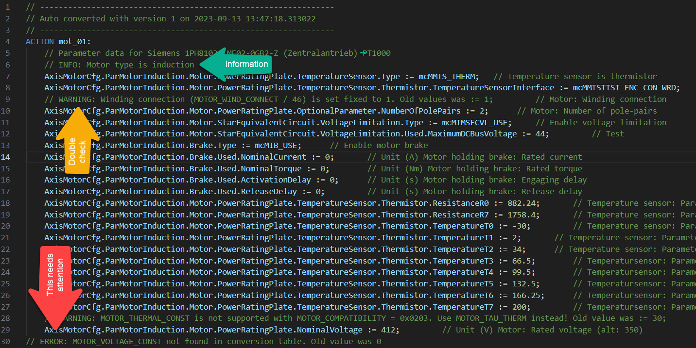
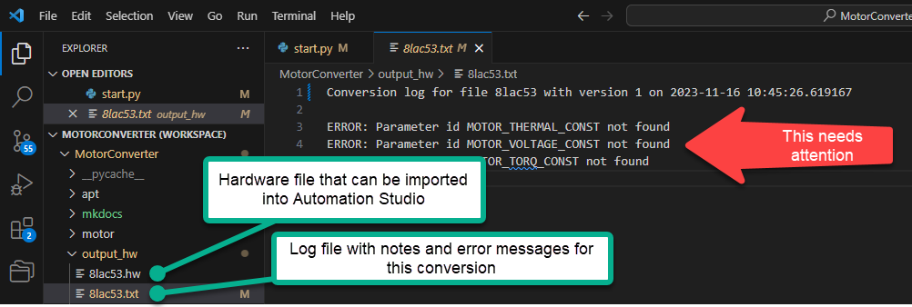
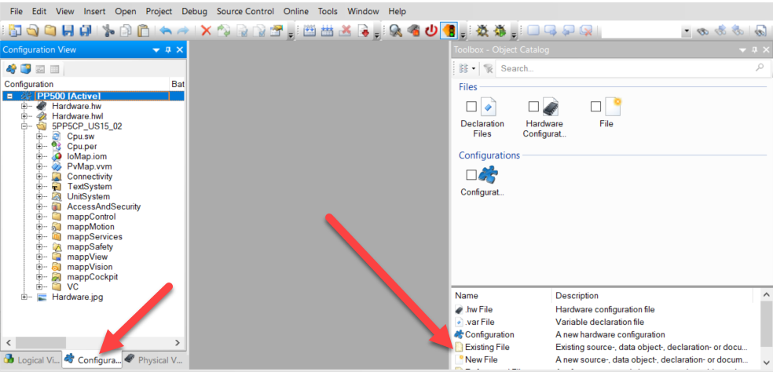
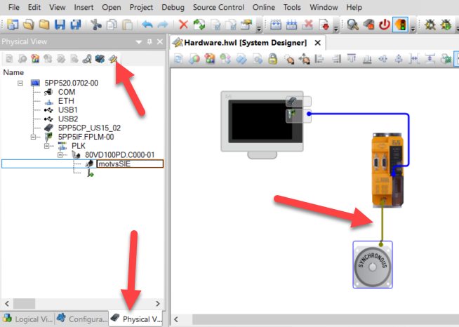
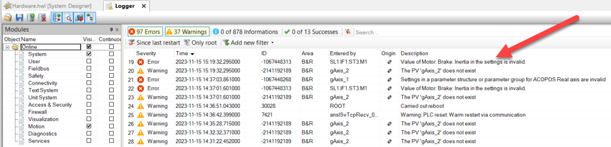

## Usage
Copy one or more motor table files into the directory "apt". Open a command window and execute the following command to start the conversion.

```
python ./start.py
```

The script generates a corresponding structure text file in the folder *output_struc* and a hardware file in *output_hw*. 

### Variable structure files
The structure text file has an action that assigns all previous parameters to a variable structure with the name *ParMotorSynchronous* (McCfgMotSynType) for synchronous motors and *ParMotorInduction* (McCfgMotInductType) for induction motors. The variable types are part of the mappMotion library McAcpAx. The variable structures can then be connected to the function block MC_BR_ProcessConfig (9c2eadae-8494-4e9a-b305-0afa2dabf1d4) that changes the motor configuration. This method is required when there a multiple motor options for a specific drive and motor selection is done during commissioning.

### Hardware files
The hardware file can be directly imported into Automation Studio and then connected to the corresponding drive. This method is preferred when there is only one motor option for a drive.

### Content of variable structure files
The script generates a structure text file for each motor in the folder *output_struc* with an action and the converted variable structure. Pay attention to the additional comments in the converted file. 

* **INFO**: Just useful information.
* **WARNING**: May or may not be a problem. Double check and delete when not relevant or corrected otherwise.
* **ERROR**: This needs attention. In most cases parameters were not translated and this can cause damage to the motor when not dealt with accordingly.

The structure text file can be added to the Automation Studio project in the logical view. Call the action to assign the parameters to the variable structure.



## Content for hardware file
The script generates a hardware file that can be imported into Automation Studio. Since the converted hardware file does not allow for any comments there is an additional log file for each converted motor. Make sure to check this file for any warnings or errors.



To import the hardware file into Automation Studio open the configuration view and then select 'Existing file' from the toolbox and select the converted hardware file.



**It is important to close Automation Studio after the import and then reopen it.** Otherwise the hardware configuration will not be updated correctly. Go to the physical view and open the *System Designer*. The new motor is visible but not connected to any drive. Connect the motor to the drive. Use the PLC simulation to download the project for a first test.



Open the logger and select only Motion. Unselect *Successes* and *Informations*. Make sure that there is no configuration error for the motor.



## Limitations
The script has the following known limitations

* Only motor type *Star Equivalent Circuit* is supported right now. 
* Encoder configuration (ENCOD_TYPE, SCALE_ENCOD_INCR) is not supported right now because it was moved out of the motor configuration and up one level into the inverter configuration.
* Motor temperature sensor reference MOTOR_TEMPMODEL_REFSENS must be listed after temperature model TEMP_MOTOR_MODEL_MODE in the apt file.

