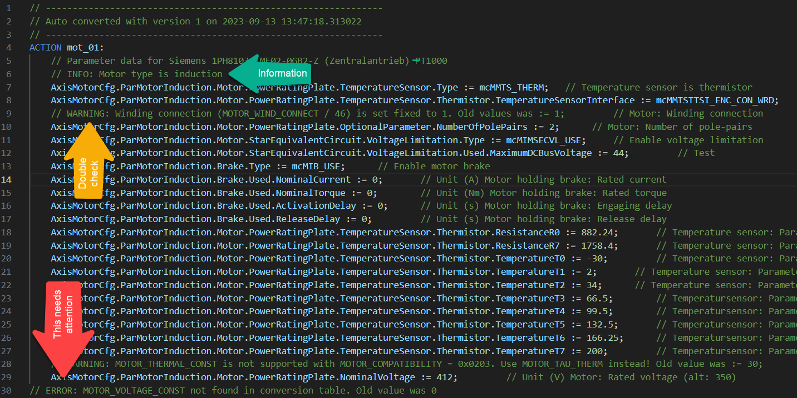

## Usage
Copy one or more motor table files into the directory "apt". Open a command window and execute the following command to start the conversion.

```
python ./start.py
```

The script generates a corresponding structure text file with an action that assigns all previous parameters to a variable structure with the name ParMotorSynchronous (McCfgMotSynType) for synchronous motors and ParMotorInduction (McCfgMotInductType) for induction motors. The variable types are part of the mappMotion library McAcpAx. The variables can be connected to the function block MC_BR_ProcessConfig (9c2eadae-8494-4e9a-b305-0afa2dabf1d4) that changes the motor configuration.

## Output
The script generates a structure text file with an action and the converted variable structure. Pay attention to the additional comments in the converted file. 

* **INFO**: Just useful information.
* **WARNING**: May or may not be a problem. Double check and delete when not relevant or corrected otherwise.
* **ERROR**: This needs attention. In most cases parameters were not translated and this can cause damage to the motor when not dealt with accordingly.



## Limitations
The script has the following known limitations

* Encoder configuration (ENCOD_TYPE, SCALE_ENCOD_INCR) is not supported right now because it was moved out of the motor configuration and moved up one level into the inverter configuration.
* Motor temperature sensor reference MOTOR_TEMPMODEL_REFSENS must be set after temperature model TEMP_MOTOR_MODEL_MODE

